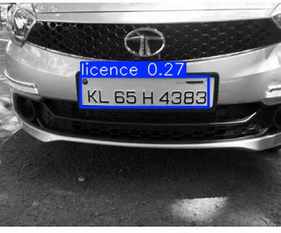
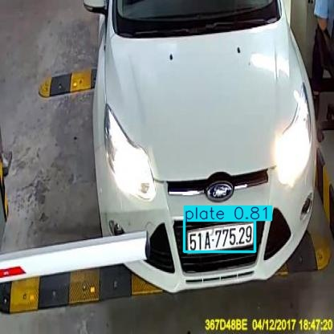

# License Plate Detection and Text Extraction Project

    
    

## Overview

This project leverages YOLO (You Only Look Once) for detecting license plates in video frames and EasyOCR for extracting text from those plates. The process involves training a YOLO model on annotated images, predicting license plates in a video, and displaying the detected text.

## Requirements

- Python 3.10 or higher
- Ultralytics YOLOv8
- OpenCV
- EasyOCR
- Google Colab (or local environment with appropriate CUDA setup)

## Setup

1. **Clone the Repository** 
 
Install Required Libraries: If using Google Colab, you can install the libraries directly in a notebook cell:

python
Copier le code
!pip install torch torchvision torchaudio --extra-index-url https://download.pytorch.org/whl/cu121
!pip install easyocr opencv-python
Prepare Your Dataset:

Annotate your dataset using tools like Roboflow or LabelImg.
Ensure the dataset is structured correctly with images and corresponding annotation files.
Training the YOLO Model
Train the YOLO model using the following command in a Colab notebook or terminal:

bash
Copier le code
!yolo task=detect mode=train data=/content/plate-detect-1/data.yaml epochs=20 imgsz=640 model=yolov10b.pt
data.yaml: Path to your dataset configuration file.
epochs: Number of training epochs.
imgsz: Size of images used for training.
Predicting License Plates in a Video
The following code reads a video file, processes each frame, detects license plates, and extracts the text:

python
Copier le code
import cv2
import easyocr
from google.colab.patches import cv2_imshow

# Initialize EasyOCR

# Replace with your video path
video_path = '/content/video.mp4'
process_video(video_path)
Code Breakdown
EasyOCR Initialization: Initializes the OCR reader for text extraction.
Video Processing: Opens the video file and processes each frame:
Saves the current frame as an image.
Uses YOLO to detect license plates.
Reads text from the annotated image using EasyOCR.
Draws bounding boxes around detected plates and displays the text.
